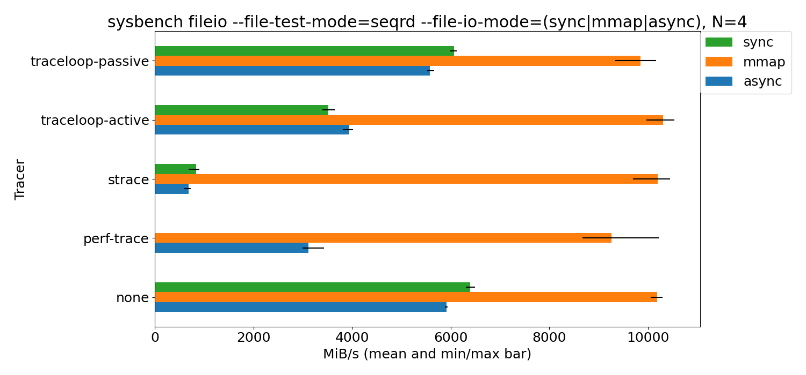

# traceloop

traceloop is a command line tool to trace system calls in a similar way to
strace but with some differences:
- traceloop uses BPF instead of ptrace
- traceloop's tracing granularity is the control group (cgroup) instead of a
  process
- traceloop's traces are recorded in a fast, in-memory, overwritable ring
  buffer like a flight recorder. The tracing could be permanently enabled and
  inspected in case of crash.

traceloop can be used directly on the command line or via an HTTP interface.

traceloop has been written to trace Kubernetes Pods with [Inspektor
Gadget](https://github.com/kinvolk/inspektor-gadget), but it can as easily be
used with systemd services that are in their own control groups (look for
`.service` and `.scope` directories inside `/sys/fs/cgroup/unified/`).

## On the command line

Example with an existing systemd service:
```
sudo -E ./traceloop cgroups /sys/fs/cgroup/unified/system.slice/sshd.service
```

Example with a custom command:
```
sudo systemd-run -t  --unit=test42.service  /bin/sh -c 'for i in $(seq 1 1000) ; do sleep 4 ; echo 2*3*7 | bc > /dev/null ; echo Multiplication $i done. ; done'
...
sudo -E ./traceloop cgroups /sys/fs/cgroup/unified/system.slice/test42.service
...
00:04.022260640 cpu#0 pid 23981 [bc] brk(brk=0) = 94045092683776
00:04.022346588 cpu#0 pid 23981 [bc] ioctl(fd=0, cmd=21505, arg=140721805741680) = 18446744073709551591
00:04.022361201 cpu#0 pid 23981 [bc] read(fd=0, buf=94045092586128 "2*3*7\n", count=8192) = 6
00:04.022401517 cpu#0 pid 23981 [bc] fstat() = 0
00:04.022414650 cpu#0 pid 23981 [bc] ioctl(fd=1, cmd=21505, arg=140721805741312) = 18446744073709551591
00:04.022440173 cpu#0 pid 23981 [bc] write(fd=1, buf=94045092602832 "42\n", count=3) = 3
00:04.022460351 cpu#0 pid 23981 [bc] read(fd=0, buf=94045092586128 "", count=8192) = 0
00:04.022475888 cpu#0 pid 23981 [bc] ioctl(fd=0, cmd=21505, arg=140721805741616) = 18446744073709551591
00:04.022525326 cpu#0 pid 23981 [bc] exit_group(error_code=0)...
00:04.022833827 cpu#2 pid 23961 [sh] ...wait4() = 23981
```


## With Docker

```
docker run --rm -v /sys/kernel/debug:/sys/kernel/debug -v /sys/fs/cgroup:/sys/fs/cgroup -v /sys/fs/bpf:/sys/fs/bpf -v /run:/run --privileged kinvolk/traceloop
```

## With HTTP interface

```
sudo -E ./traceloop serve
...

$ sudo curl --unix-socket /run/traceloop.socket 'http://localhost/add?name=sshd&cgrouppath=/sys/fs/cgroup/unified/system.slice/sshd.service'
added as id 0
$ sudo curl --unix-socket /run/traceloop.socket 'http://localhost/list'
0: [sshd] /sys/fs/cgroup/unified/system.slice/sshd.service
$ sudo curl --unix-socket /run/traceloop.socket 'http://localhost/dump-by-cgroup?cgroup=/sys/fs/cgroup/unified/system.slice/sshd.service'
...

```

## With systemd services using traceloopctl and the HTTP interface to integrate with systemd

The `contrib/traceloopctl` helper is a command line tool to manage traceloop logs and has a special mode for systemd units.
This works when systemd unit traces have a name that consits of the systemd unit file name combined with the systemd service invocation ID through a `_` character (`%n_$INVOCATION_ID`).

```
$ contrib/traceloopctl
Usage: contrib/traceloopctl COMMAND|-h|--help
Needs to be run with access to /run/traceloop.socket (e.g., with sudo).
Commands:
  list-all
  dump-id ID
  dump-name NAME
  close-id ID
  close-name NAME
  add-current-cgroup NAME

  list-sd-units
  list-sd-traces SERVICE
  dump-sd SERVICE INVOCATION|-1
  close-sd SERVICE INVOCATION|-1|all
  add-current-cgroup-sd SERVICE INVOCATION

The *-sd commands assume the trace name format is systemd_UNIT_INVOCATIONID which can be automated with:
  ExecStartPre=+/…/contrib/traceloopctl add-current-cgroup-sd "%n" "$INVOCATION_ID"
```

First you need to make sure that traceloop runs as a service:

```
sudo cp contrib/traceloop.service /etc/systemd/system/traceloop.service
# You can enable it always or just start it on demand pulled in as dependency: sudo systemctl enable --now traceloop.service
```

Now add `Requires=traceloop.service` and `After=traceloop.service` directives to the `[Unit]` section of your service.
In the `[Service]` section you have to add a special command that registers the unit CGroup with traceloop: add `ExecStartPre=+/PATH/TO/kinvolk/traceloop/contrib/traceloopctl add-current-cgroup-sd "%n" "$INVOCATION_ID"` as very first `ExecStartPre` line.
The `+` prefix means to ignore any `User=` directives but run as root user and also ignore any filesystem changes like `ProtectSystem=`.
This allows us to use the system's exec path and write to `/run/traceloop.socket` regardless of the restrictions applying for the regular `ExecStartPre=`/`ExecStart=` processes.

An example unit `my-service.service` looks like this:

```
[Unit]
Description=My Service
# Add:
Requires=traceloop.service
# Add:
After=traceloop.service

[Service]
User=1000
Group=1000
ProtectSystem=strict
NoNewPrivileges=yes

# Add:
ExecStartPre=+/PATH/TO/kinvolk/traceloop/contrib/traceloopctl add-current-cgroup-sd "%n" "$INVOCATION_ID"

ExecStart=/bin/echo Hello World
```

Instead of modifying the original `my-service.service` unit file you can also do the traceloop registration through a small drop-in unit file in `/etc/systemd/system/my-service.service.d/10-traceloop.conf`:

```
[Unit]
Requires=traceloop.service
After=traceloop.service

[Service]
# The + prefix means to ignore the User= but run as root and ignore filesystem changes like ProtectSystem=, this allows us to use the system's curl and write to /run/
ExecStartPre=+/PATH/TO/kinvolk/traceloop/contrib/traceloopctl add-current-cgroup-sd "%n" "$INVOCATION_ID"
```

Start the service with `sudo systemctl daemon-reload; sudo systemctl restart my-service.service` and observe the traces:

```
# List the traced systemd units:
$ list-sd-units
 Traces Units
------- -----
      1 my-service.service
# Now list the traces:
$ contrib/traceloopctl list-sd-traces my-service.service
a72e5d0f2b7e405894ca4664ddf205b1
# Dump the trace:
$ contrib/traceloopctl dump-sd my-service.service -1 | less
# Clean up afterwards:
$ contrib/traceloopctl close-sd my-service.service all
closed
```

### Talk at Linux Plumbers Conference 2020

A comprehensive presentation was held at LPC 2020 in the Networking and BPF Summit.
See the slides [here](https://linuxplumbersconf.org/event/7/contributions/667/attachments/510/919/Traceloop_and_BPF_Linux_Plumbers_Conference_-_LPC_2020.pdf).

After feedback to include a comparison to `perf trace` we reran the benchmark but omitted the synchronous write syscall case that logs the buffer contents because dumping the buffers is not implemented in `perf trace`. Here the results:


